# AWS SAM for Java with IntelliJ IDEA

## Why not Visual Studio Code?

AWS SAM for Java applications is not compatible with VSCode, the languages that VSCode + SAM supports are: Nodejs, .NET and Python (2.x and 3.x). To see the development of the discovery see [post](https://medium.com/serverlessvsspring/configuration-of-visual-studio-code-b29402dc91b8).

## Requirements

To use SAM in IntelliJ is necessary:

- [AWS account:](https://aws.amazon.com/) Choose Create an AWS Account, or Complete Sign Up.
- [AWS CLI:](https://docs.aws.amazon.com/es_es/cli/latest/userguide/cli-chap-install.html) The AWS Command Line Interface (AWS CLI) is an open source tool that enables you to interact with AWS services using commands in your command-line shell.
- [Docker:](https://www.docker.com/) The AWS SAM CLI requires this open-source software container platform.
- [AWS SAM CLI:](https://aws.amazon.com/es/serverless/sam/) This is an AWS CLI tool that helps you develop, test, and analyze your serverless applications locally.
- [Java JDK.](https://www.oracle.com/technetwork/java/javase/downloads/jdk8-downloads-2133151.html)
- [IntelliJ IDEA.](https://www.jetbrains.com/idea/download/)

## Configuration

To see my experience and problems encountered see [post](https://medium.com/serverlessvsspring/aws-sam-in-intellij-idea-17ec708d3b70).

1. Configure AWS CLI: 
    1. In AWS Web, click in your user > My Security Credentials:

        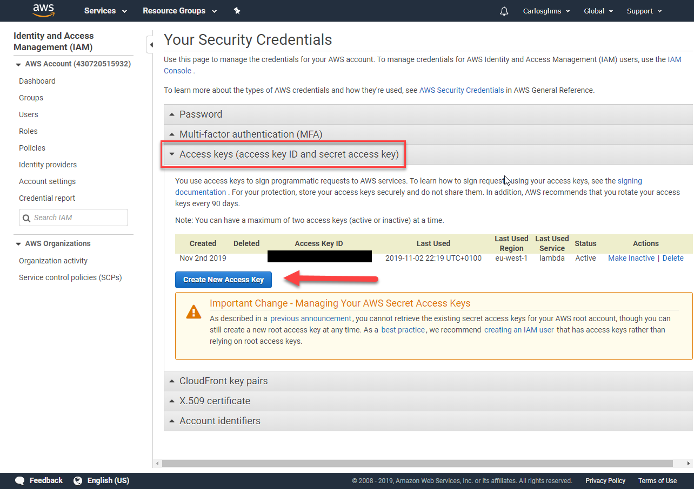

    2. In console, write "aws configure" command and add the id and secret of aws web, select your region and preferred output format. If you want to create a specific configuration profile use: "aws configure --profile <profileName\>":
    
        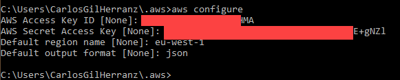

2. Install AWS Toolkit in IntelliJ: File > Settings:

    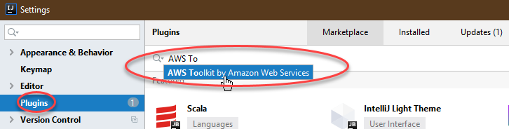

3. In IntelliJ, chose File > New > Project...

    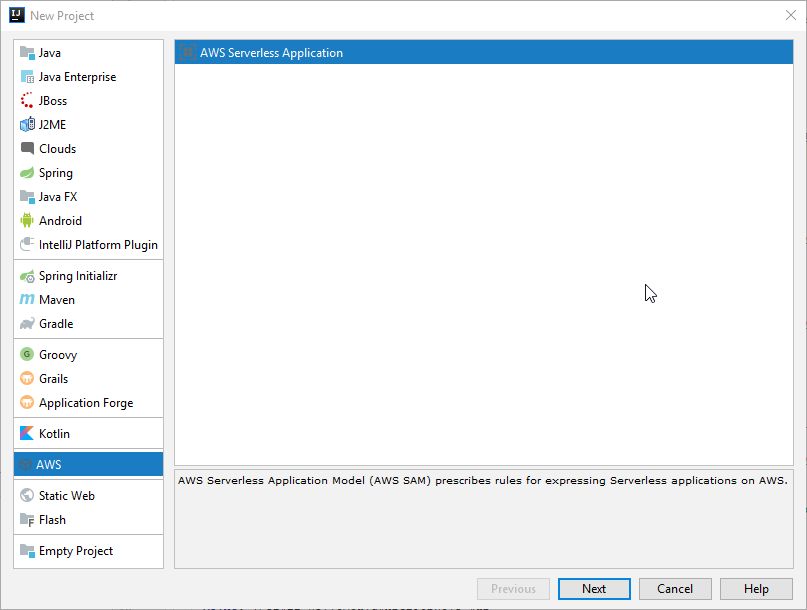 
    
    and apply this config:

    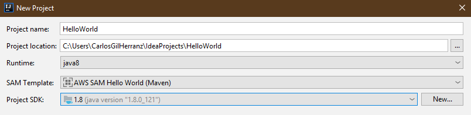 
    
    It will show an AWS demo project with which we will continue explaining how to use SAM.

4. Connect IntelliJ IDEA with AWS: Press tab "AWS Explorer"

    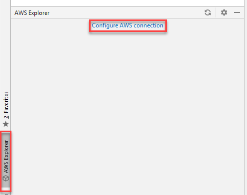 
        
        
    and then the configuration profile that we want to use. If in step 1.2. you have made "aws configure" without specifying any profile, this profile will be default.
    
    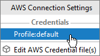

## Run and Debug

It is possible to run and debug the application on IntelliJ, for this you have to apply a configuration like this:

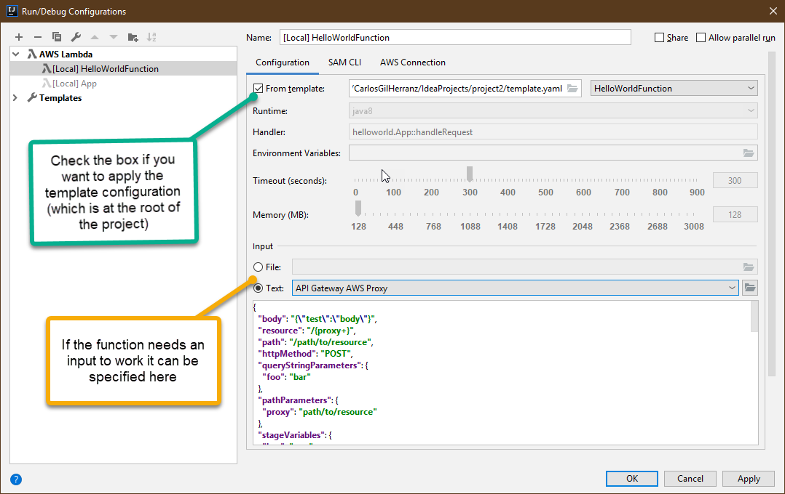

### Run Example

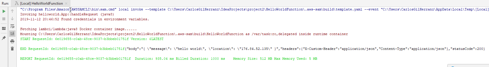

### Debug Example

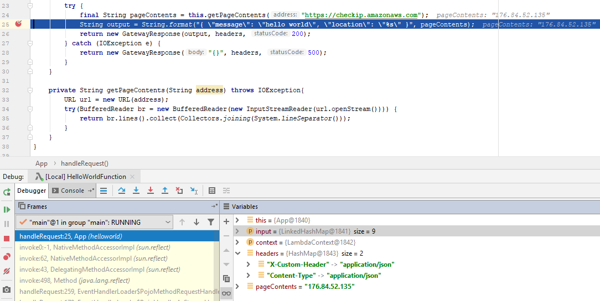

## Deploy

To deploy the application:

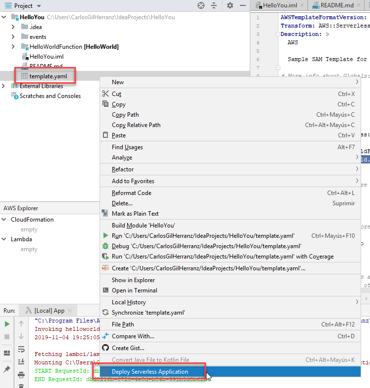

and apply the configuration

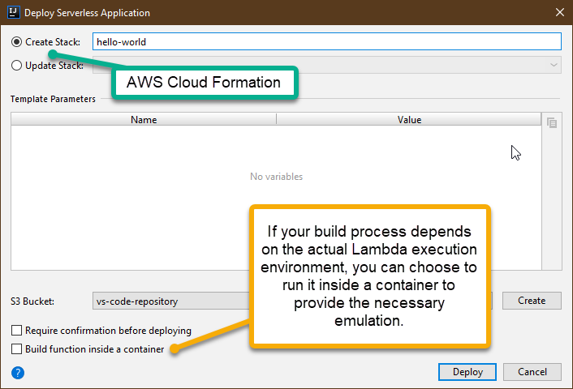

 - Stack: The name of the AWS CloudFormation stack that is create when deploying this serverless application.
 - S3 Bucket: AWS repository where the application will be stored (create one if none exists).

 After configuration press deploy and the result will look like this:

 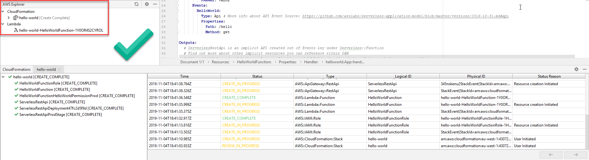

We can ensure that the application was deployed by consulting the AWS Web environment in the Lambda section:

 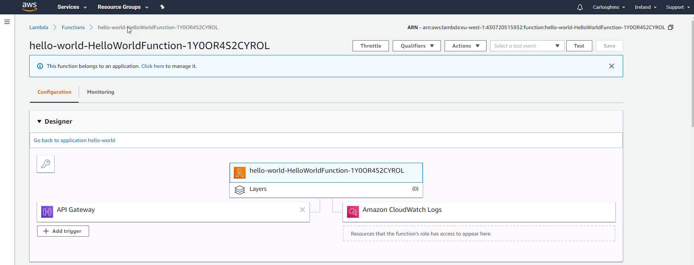
