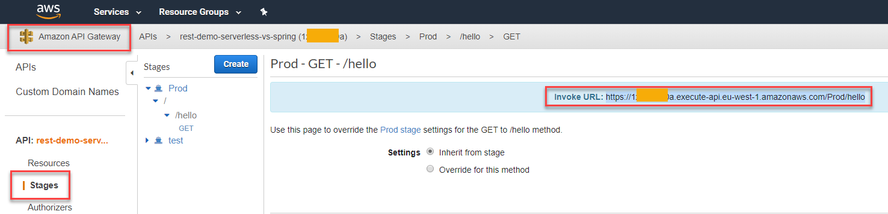

# REST comparative AWS Lambda and Spring with Java

## To get started

<details>
<summary>AWS Lambda</summary>
<p>

## Requirements

For REST-Lambda demo is necessary:

- [AWS account:](https://aws.amazon.com/) Choose Create an AWS Account, or Complete Sign Up.
- [AWS CLI:](https://docs.aws.amazon.com/es_es/cli/latest/userguide/cli-chap-install.html) The AWS Command Line Interface (AWS CLI) is an open source tool that enables you to interact with AWS services using commands in your command-line shell.
- [AWS SAM CLI:](https://aws.amazon.com/es/serverless/sam/) This is an AWS CLI tool that helps you develop, test, and analyze your serverless applications locally.
- [Maven.](https://maven.apache.org/download.cgi)
- [Java JDK.](https://www.oracle.com/technetwork/java/javase/downloads/jdk8-downloads-2133151.html)

## Configure AWS CLI

1. In AWS Web, click in your user > My Security Credentials:

    

2. In console, write "aws configure" command and add the id and secret of aws web, select your region and preferred output format. If you want to create a specific configuration profile use: "aws configure --profile <profileName\>":

    

## Installation

1. Write the following command to clone this repository in the dir that you want:

    ``` sh
    git clone https://github.com/codeurjc-students/2019-ServerlessVsSpring.git
    ```

2. From the console, navigate to the folder **"sections/REST-AWS-Spring/source/aws-lambda/HelloWorldFunction"**.

3. To install the necessary dependencies for this project, execute:
    ``` sh
    mvn clean install
    ```

4. Create an AWS S3 bucket to storage the application.

    To create the bucket, use this command:
    ``` sh
    aws s3api create-bucket --bucket rest-demo-serverless-vs-spring --region eu-west-1 --create-bucket-configuration LocationConstraint=eu-west-1
    ```

5. We need to package our SAM applicaction. Execute this command in **aws-lambda** folder:
    ``` sh
    sam package --template-file template.yaml --s3-bucket my-bucket --output-template-file packaged-template.yaml
    ```

6. Now we must deploy the application with the following command:
    ``` sh
    sam deploy --template-file packaged-template.yaml --stack-name rest-demo-serverless-vs-spring --capabilities CAPABILITY_IAM
    ```

## Use

We can get the url of the lambda function by navigating to API Gateway:




</details>
</p>
<details>
<summary>Spring with Java</summary>
<p>

## Requirements

For REST-Spring demo is necessary:

- [Maven.](https://maven.apache.org/download.cgi)
- [Java JDK.](https://www.oracle.com/technetwork/java/javase/downloads/jdk8-downloads-2133151.html)

## Installation

1. Write the following command to clone this repository in the dir that you want:
    ``` sh
    git clone https://github.com/codeurjc-students/2019-ServerlessVsSpring.git
    ```

2. From the console, navigate to the folder **"sections/REST-AWS-Spring/source/java-spring/hello_world"**.

3. To install the necessary dependencies for this project, execute:
    ``` sh
    mvn clean install
    ```

## Use

1. Run the application:
    ``` sh
    java -jar target/hello_world-0.0.1-SNAPSHOT.jar
    ```
    or 
    ``` sh
    mvn spring-boot:run
    ```

2. View get response in localhost: http://localhost:8080/greeting
   
</details>
</p>

## Comparative
