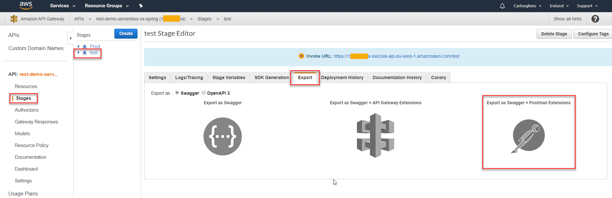
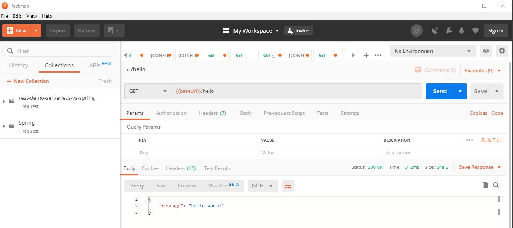
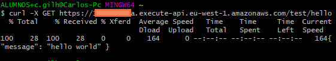

# REST comparative AWS Lambda and Spring with Java

## To get started

<details>
<summary>AWS Lambda</summary>
<p>

## Requirements

For REST-Lambda demo is necessary:

- [AWS account:](https://aws.amazon.com/) Choose Create an AWS Account, or Complete Sign Up.
- [AWS CLI:](https://docs.aws.amazon.com/es_es/cli/latest/userguide/cli-chap-install.html) The AWS Command Line Interface (AWS CLI) is an open source tool that enables you to interact with AWS services using commands in your command-line shell.
- [AWS SAM CLI:](https://aws.amazon.com/es/serverless/sam/) This is an AWS CLI tool that helps you develop, test, and analyze your serverless applications locally.
- [Maven.](https://maven.apache.org/download.cgi)
- [Java JDK.](https://www.oracle.com/technetwork/java/javase/downloads/jdk8-downloads-2133151.html)

## Configure AWS CLI

1. In AWS Web, click in your user > My Security Credentials:

    

2. In console, write "aws configure" command and add the id and secret of aws web, select your region and preferred output format. If you want to create a specific configuration profile use: "aws configure --profile <profileName\>":

    

## Installation

1. Write the following command to clone this repository in the dir that you want:

    ``` sh
    git clone https://github.com/codeurjc-students/2019-ServerlessVsSpring.git
    ```

2. From the console, navigate to the folder **"sections/REST-AWS-Spring/source/aws-lambda/HelloWorldFunction"**.

3. To install the necessary dependencies for this project, execute:
    ``` sh
    mvn clean install
    ```

4. Create an AWS S3 bucket to storage the application.

    To create the bucket, use this command:
    ``` sh
    aws s3api create-bucket --bucket rest-demo-serverless-vs-spring --region eu-west-1 --create-bucket-configuration LocationConstraint=eu-west-1
    ```

5. We need to package our SAM applicaction. Execute this command in **aws-lambda** folder:
    ``` sh
    sam package --template-file template.yaml --s3-bucket my-bucket --output-template-file packaged-template.yaml
    ```

6. Now we must deploy the application with the following command:
    ``` sh
    sam deploy --template-file packaged-template.yaml --stack-name rest-demo-serverless-vs-spring --capabilities CAPABILITY_IAM
    ```

## Use

### Postman
We can get the url of the lambda function by navigating to API Gateway:


We can import the API as follows and export from Postman:



If we import the package from Postman we can make the request:



``baseUrl`` is the invoke URL, something like this: https://xxxxxxxxxx.execute-api.eu-west-1.amazonaws.com/stage

To know how to create an api-key see this url: [api-key AWS](https://docs.aws.amazon.com/apigateway/latest/developerguide/api-gateway-setup-api-key-with-console.html)

If we add ``/hello`` to the invoke URL, we make the request to the GET method.

### CURL

We can also request with a Curl as follows:



</details>
</p>
<details>
<summary>Spring with Java</summary>
<p>

## Requirements

For REST-Spring demo is necessary:

- [Maven.](https://maven.apache.org/download.cgi)
- [Java JDK.](https://www.oracle.com/technetwork/java/javase/downloads/jdk8-downloads-2133151.html)

## Installation

1. Write the following command to clone this repository in the dir that you want:
    ``` sh
    git clone https://github.com/codeurjc-students/2019-ServerlessVsSpring.git
    ```

2. From the console, navigate to the folder **"sections/REST-AWS-Spring/source/java-spring/hello_world"**.

3. To install the necessary dependencies for this project, execute:
    ``` sh
    mvn clean install
    ```

## Use

Run the application:
``` sh
java -jar target/hello_world-0.0.1-SNAPSHOT.jar
```
or 
``` sh
mvn spring-boot:run
```

With http://localhost:8080/hello we can make the following requests by browser, postman and curl.

### Postman


### CURL


   
</details>
</p>

## Comparative

### Functionality

About the functionality there are no differences, both, Spring and lambda, receive a request and execute a code that elaborates the response. If we focus on the number of requests that can be processed, the winner is undoubtedly AWS Lambda, as it scales according to the number of requests to respond. In Spring, an autoescalated system is not contemplated, an architecture that responds according to the number of requests must be designed, for the other hand, with lambda, that architecture is implicit. Keep in mind that lambdas are stateless functions, each time they are executed through events, a new environment is created. In spring, the functions have state.

### Implementation

With respect to the implementation, Spring presents a clearer and more defined separation of objects, however, the objects are comparable in our examples:

Spring presents a main function clearly separated from the rest of the code:

**[Application.java](./source/java-spring/hello_world/src/main/java/hello/Application.java) in Spring:**
``` java
@SpringBootApplication
public class Application {

    public static void main(String[] args) {
        SpringApplication.run(Application.class, args);
    }
}
```

The closest thing to a main entry with respect to Lambda is the template we generate with SAM, which indicates which controller should be executed when calling lambda (Resources.HelloWorldFunction.Properties.Handler):

**[template.yaml](./source/aws-lambda/template.yaml) in AWS Lambda:**
``` yaml
Resources:
  HelloWorldFunction:
    Type: AWS::Serverless::Function
    Properties:
      CodeUri: HelloWorldFunction
      Handler: helloworld.App::handleRequest 
      Runtime: java8
      MemorySize: 512
      Environment:
        Variables:
          PARAM1: VALUE
      Events:
        HelloWorld:
          Type: Api
          Properties:
            Path: /hello
            Method: get
```
We also see that the template sets the values of the lambda function, which will be of the Api type (``@RestController`` in Spring), sets the route where it will be executed (the equivalent of ``@RequestMapping ("/hello")`` in Spring) and with what method (In Spring, ``method = RequestMethod.GET``).

**[HelloWorldController.java](./source/java-spring/hello_world/src/main/java/hello/HelloWorldController.java) in Spring:**

``` java
@RestController
public class HelloWordController {

    @RequestMapping(value = "/hello", method = RequestMethod.GET)
    public ResponseEntity<String> hello(@RequestParam(required = false) final Object input, @RequestParam(required = false) final Context context) {
        HttpHeaders headers = new HttpHeaders();
        headers.add("Content-Type", "application/json");
        headers.add("X-Custom-Header", "application/json");
        String output = "{ \"message\": \"hello world\"}";
        return new ResponseEntity<String>(output, headers, HttpStatus.OK);
    }
}
```
As we have seen in the template handler, the request will call the function **HandleRequest** of the class **App**:

**[App.java](./source/aws-lambda/HelloWorldFunction/src/main/java/helloworld/App.java) in AWS Lambda:**
``` java
public class App implements RequestHandler<Object, Object> {

    public GatewayResponse handleRequest(final Object input, final Context context) {
        Map<String, String> headers = new HashMap<>();
        headers.put("Content-Type", "application/json");
        headers.put("X-Custom-Header", "application/json");
        String output = String.format("{ \"message\": \"hello world\"}");
        return new GatewayResponse(output, headers, 200);
    }
}
```
The handle prepares the elements that the GatewayResponse object needs. 
``final Object input, final Context context`` is the equivalent of ``@RequestParam(required = false) final Object input, @RequestParam(required = false) final Context context``. We can observe that in AWS, the headers are formed as a map while in Spring we have the object HttpHeaders. AWS lambda interprets the GatewayResponse object to form the request responses.

</details>
</p>

<details>
<summary>GatewayResponse.java class in AWS Lambda</summary>
<p>

[GatewayResponse.java](./source/aws-lambda/HelloWorldFunction/src/main/java/helloworld/GatewayResponse.java)

``` java
public class GatewayResponse {

    private final String body;
    private final Map<String, String> headers;
    private final int statusCode;

    public GatewayResponse(final String body, final Map<String, String> headers, final int statusCode) {
        this.statusCode = statusCode;
        this.body = body;
        this.headers = Collections.unmodifiableMap(new HashMap<>(headers));
    }

    public String getBody() {
        return body;
    }

    public Map<String, String> getHeaders() {
        return headers;
    }

    public int getStatusCode() {
        return statusCode;
    }
}
```
</details>
</p>

Although the way to proceed is different as you can see in [To get started](#to-get-started), we can see that the implementations are very similar, only the headings of the functions and the imports of the classes differ.


