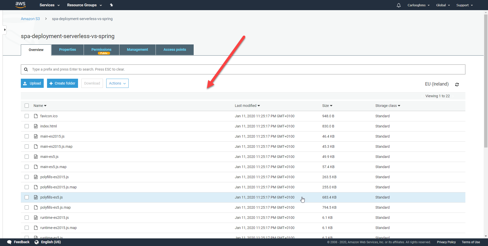

# Single-page application (SPA): Comparative of a Non-Serverless (Local) deployment vs Serverless (AWS) deployment

## To get started

<details>
<summary>Serverless deployment (AWS S3)</summary>
<p>

## Requirements

For Serverless deployment demo in AWS S3 is necessary:

- [AWS account:](https://aws.amazon.com/) Choose Create an AWS Account, or Complete Sign Up.
- [AWS CLI:](https://docs.aws.amazon.com/es_es/cli/latest/userguide/cli-chap-install.html) The AWS Command Line Interface (AWS CLI) is an open source tool that enables you to interact with AWS services using commands in your command-line shell.
- [npm CLI](https://www.npmjs.com/get-npm)

## Configure AWS CLI

1. In AWS Web, click in your user > My Security Credentials:

    

2. In console, write "aws configure" command and add the id and secret of aws web, select your region and preferred output format. If you want to create a specific configuration profile use: "aws configure --profile <profileName\>":

    

## Installation

1. Write the following command to clone this repository in the dir that you want:

    ``` sh
    git clone https://github.com/codeurjc-students/2019-ServerlessVsSpring.git
    ```

2. From the console, navigate to the folder **"sections/SPA-Deployment/source/spa-angular"**.

3. To install the necessary dependencies for this project, execute:
    ``` sh
    npm install
    ```

4. Create an AWS S3 bucket to storage the single-page application.

    To create the bucket, use this command:
    ``` sh
    aws s3api create-bucket --bucket spa-deployment-serverless-vs-spring --region eu-west-1 --create-bucket-configuration LocationConstraint=eu-west-1 --acl public-read
    ```
    - ``` --acl public-read ``` granted a public read permission.
    - ``` spa-deployment-serverless-vs-spring ```, the name of the bucket.

5. Build and deploy the single-page application to your AWS S3 (**spa-deployment-serverless-vs-spring** in my case):

    ``` sh
    npm run build && aws s3 sync dist/spa-angular/ s3://spa-deployment-serverless-vs-spring
    ```
6. Go to https://s3.console.aws.amazon.com/s3/home and select your bucket (if you can't see it, try changing the region), select your bucket and check that it has content:

    

7. Go to **Permissions > Bucket Policy** and paste this and save:

    ```json
    {
        "Version": "2012-10-17",
        "Statement": [
            {
                "Sid": "Allow Public Access to All Objects",
                "Effect": "Allow",
                "Principal": "*",
                "Action": "s3:*",
                "Resource": "arn:aws:s3:::spa-deployment-serverless-vs-spring/*"
            }
        ]
    }
    ```
    how can you see here:

    

8. Go to **Properties > Static website hosting >** check **Use this bucket to host a website** and write ``` index.htm ``` in both fields and save:

    

## Use

You can access to the single-page application with the address marked in yellow in the previous snapshot:


</details>
</p>
<details>
<summary>Non-serverless deployment (Locally)</summary>
<p>

## Requirements

To deploy locally with angular is necessary:

- [npm CLI](https://www.npmjs.com/get-npm)


## Installation

1. Write the following command to clone this repository in the dir that you want:
    ``` sh
    git clone https://github.com/codeurjc-students/2019-ServerlessVsSpring.git
    ```

2. From the console, navigate to the folder **"sections/SPA-Deployment/source/spa-angular"**.

3. To install the necessary dependencies for this project, execute:
    ``` sh
    npm install
    ```

## Use

Deploy the SPA with:

``` sh
npm start
```
    

With http://localhost:4200 we see the single-page application angular demo deployed:


   
</details>
</p>

## Comparative between deployments

With this comparison we can equate the traditional way of deploying a SPA (local or on a server) with the way to do it in serverless environments.

The way to do it locally is very simple, you just need the code and a framework or library to build and deploy the SPA (in our case Angular).

Deploying the SPA in a serverless architecture is equally simple due to the facilities to manage the access control to the web and publish it with an endpoint. [Step 7](#installation) was not intuitive because the **AWS Policy Generator** function has not been useful for me and I have had to look for the json on the internet to apply the policy.


