# User management comparative AWS vs Spring

## To get started

<details>
<summary>AWS Lambda</summary>
<p>

## Requirements

For this demo is necessary:

- [AWS account:](https://aws.amazon.com/) Choose Create an AWS Account, or Complete Sign Up.
- [AWS CLI:](https://docs.aws.amazon.com/es_es/cli/latest/userguide/cli-chap-install.html) The AWS Command Line Interface (AWS CLI) is an open source tool that enables you to interact with AWS services using commands in your command-line shell.

## Configure AWS CLI

1. In AWS Web, click in your user > My Security Credentials:

    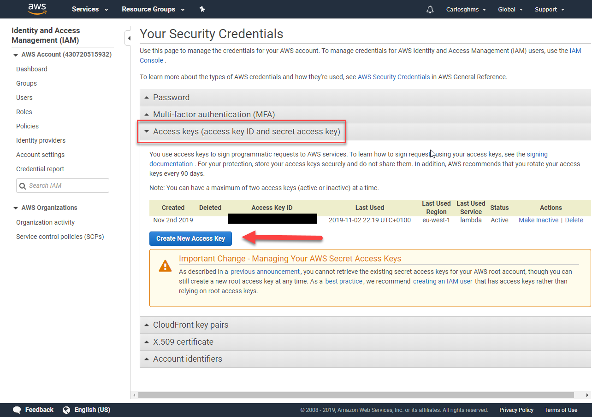

2. In console, write "aws configure" command and add the id and secret of aws web, select your region and preferred output format. If you want to create a specific configuration profile use: "aws configure --profile <profileName\>":

    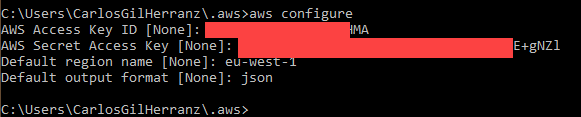

## Installation

1. Write the following command to clone this repository in the dir that you want:

    ``` sh
    git clone https://github.com/codeurjc-students/2019-ServerlessVsSpring.git
    ```

2. From the console, navigate to the folder **"sections/USERS-MANAGEMENT-AWS-Spring/source/aws-cognito"**.


3. Create an AWS S3 bucket to storage the application.

    To create the bucket, use this command:
    ``` sh
    aws s3api create-bucket --bucket usermanagement-spring-aws --region eu-west-1 --create-bucket-configuration LocationConstraint=eu-west-1
    ```

4. Go to **Permissions > Bucket Policy** and paste this and save:

    ```json
    {
        "Version": "2012-10-17",
        "Statement": [
            {
                "Sid": "Allow Public Access to All Objects",
                "Effect": "Allow",
                "Principal": "*",
                "Action": "s3:*",
                "Resource": "arn:aws:s3:::usermanagement-spring-aws/*"
            }
        ]
    }
    ```
    how can you see here in another example:

    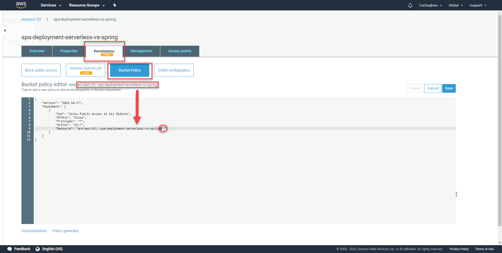


5. We need to package our SAM applicaction. Execute this command in **aws-lambda** folder:
    ``` sh
    aws s3 sync . s3://usermanagement-spring-aws --region eu-west-1
    ```

6. Go to **Properties > Static website hosting >** check **Use this bucket to host a website** and write ``` home.htm ``` in both fields and save:

    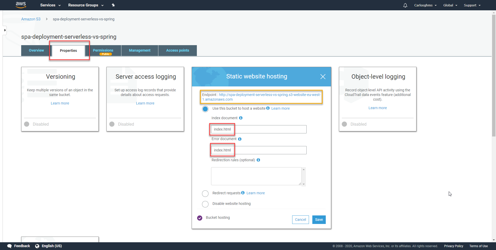

7. Create User Pool: Go to **Cognito > Create User Pool > Review defaults**

    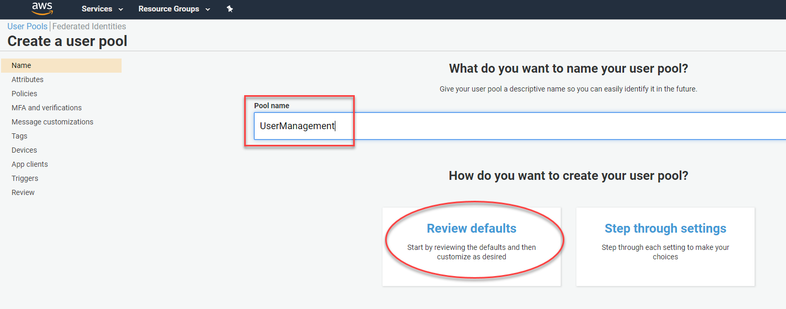

8. Add an App: Select **Add app client... > Add app client**

    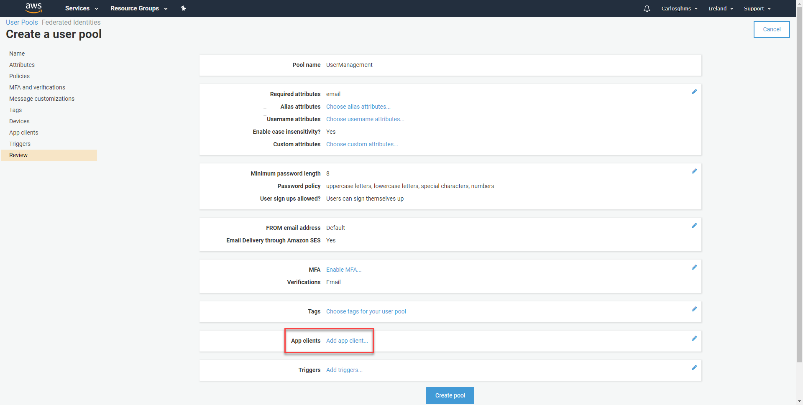

9. Fill with a name and uncheck ``` Generate client secret ``` field and press **Create app client** then, **Create Pool**:

    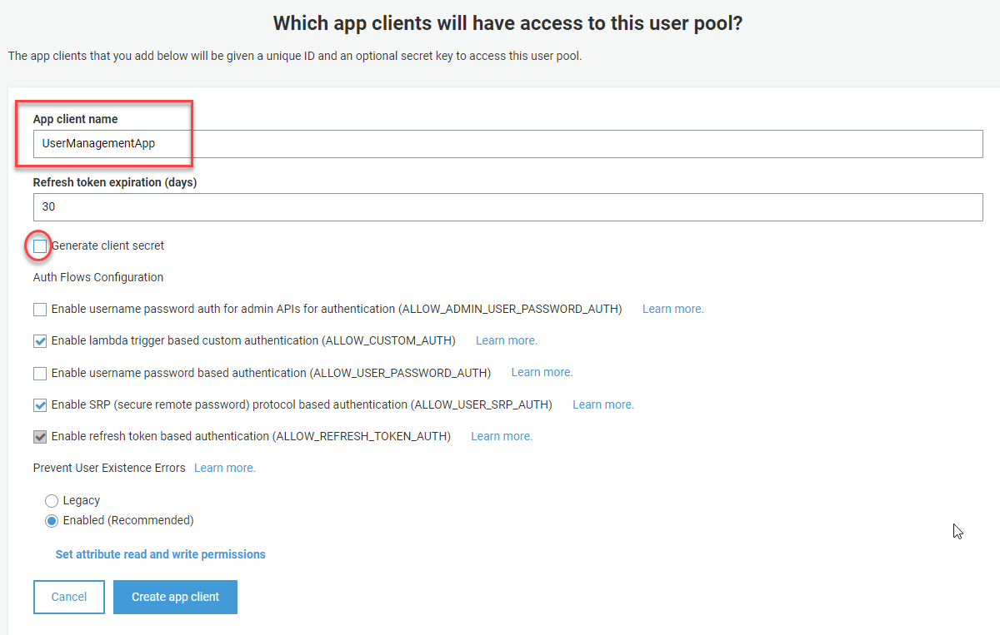

9. Modify config.js like this and reupload it:

    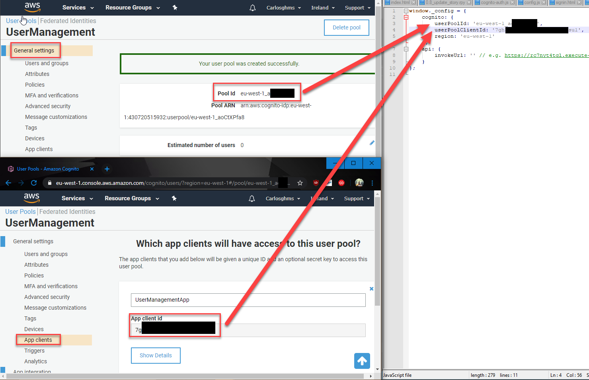

## Use

1. Go to the endpoint of the web site (your yellow box in step 6)

2. When you are inside the website, select **SIGN UP NOW**

3. Fill the fields and press **SIGNUP**

    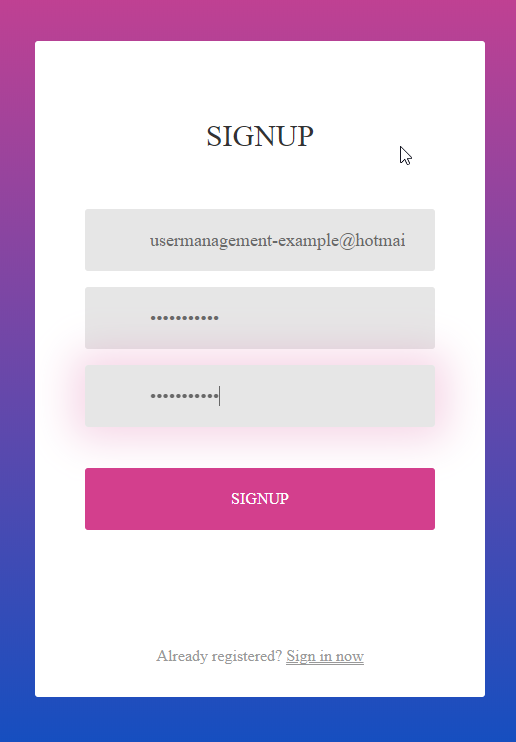

4. We will receive an email with a confirmation code. Since the mail is false, we will confirm ourselves: **Go here, select the user and press "Confirm user"**.

    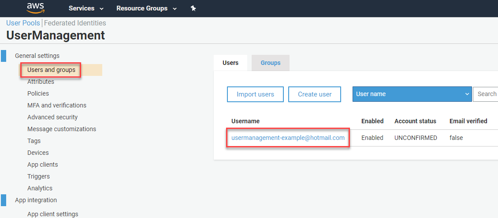

5. Now we can login:

    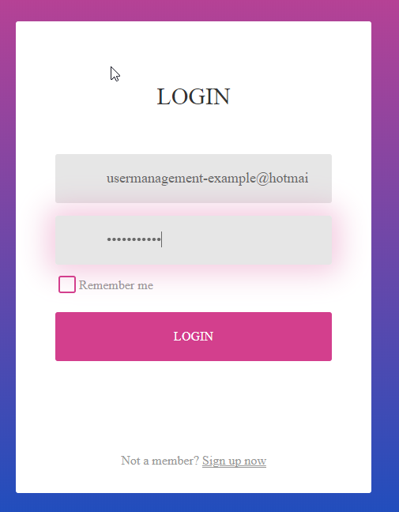

    and see the greeting:

    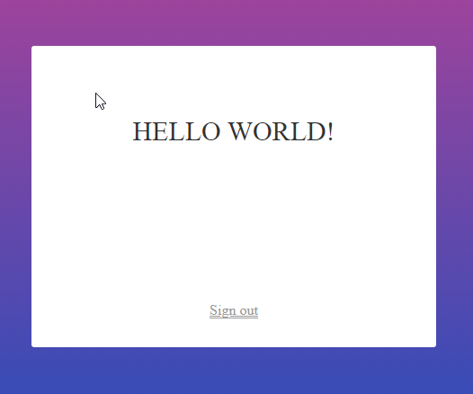

</details>
</p>
<details>
<summary>Spring Security</summary>
<p>

## Requirements

For this demo is necessary:

- [Maven.](https://maven.apache.org/download.cgi)
- [JDK.](https://www.oracle.com/technetwork/java/javase/downloads/jdk8-downloads-2133151.html)
- [IntelliJ IDEA.](https://www.jetbrains.com/idea/download/)

## Installation

### Under construction
   
</details>
</p>

## Comparative


